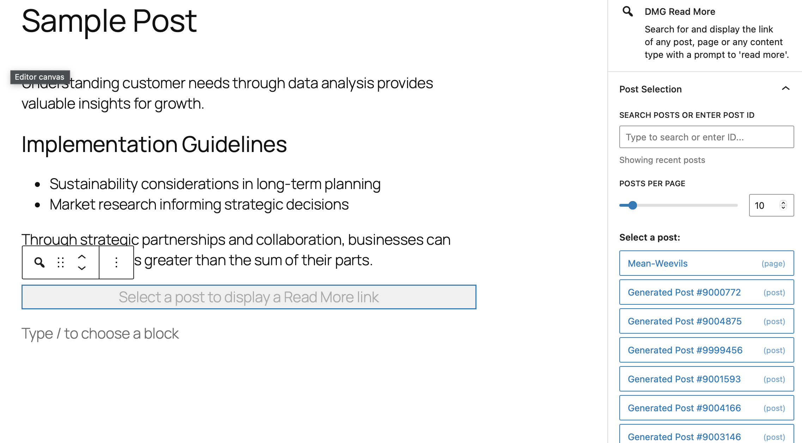

# DMG Read More Plugin

A WordPress plugin that provides a Gutenberg block for inserting "*Read more:*" links and a WP-CLI commands for searching posts that use the block. The command is optimised for sites with millions of posts.

| Block Inserter                                    | Editor Display                                         |
| ------------------------------------------------- | ------------------------------------------------------ |
|  |  |

## Features

### Gutenberg Block

- Can reference link to posts, pages, and custom post types
- Supports searching by post ID, or title/content within reasonable limits
- Uses minimal REST API queries with field limiting, and in memory caching

### WP-CLI Commands

- Find all posts containing the block within post types with block editor support
- Uses post meta flags for fast queries that scale to millions of rows
- Handles millions of posts with configurable batch sizes

## Installation

1. Clone or download this repository to your WordPress plugins directory:

   ```bash
   cd wp-content/plugins/
   git clone <repository-url>
   ```
2. Install dependencies and build:

   ```bash
   cd <repo-dir>
   npm install
   npm run build:blocks
   ```
3. Activate the plugin in WordPress admin or via WP-CLI:

   ```bash
   wp plugin activate dmg-read-more
   ```

## Local Testing

You can test the plugin locally using wp-env. Requires [Docker](https://www.docker.com) and [@wordpress/env](https://developer.wordpress.org/block-editor/reference-guides/packages/packages-env/#installation)

1. Clone or download this repository to your WordPress plugins directory:

   ```bash
   cd wp-content/plugins/
   git clone <repository-url>
   cd <repo-dir>
   npm install
   npm build:blocks
   npm start
   ```
2. Access the local server at http://localhost:8888
3. You can also package the plugin as a zip for uploads to a live server

   ```bash
      npm run package:plugin
      # ls tools/plugin-dist/dmg-read-more.zip
   ```

## Usage

### Using the Gutenberg Block

1. In the WordPress block editor, add the "DMG Read More" block
2. Use the sidebar panel to search for posts:
   - **By ID**: Enter a numeric post ID (e.g., `12345`)
   - **By Text**: Enter keywords to search titles and content
   - **Browse**: Leave empty to browse recent posts
3. Select a post from the results
4. The block displays a "Read More" link to the selected post

### WP-CLI Commands

#### Search for Posts with Blocks

Find all posts containing DMG Read More blocks:

```bash
# Search last 30 days (default)
wp dmg-read-more search

# Search specific date range
wp dmg-read-more search --date-after=2024-01-01 --date-before=2024-12-31

# Custom batch size for memory optimization
wp dmg-read-more search --batch-size=50000

```

**Parameters:**

- `--date-after=<date>`: Only posts published after this date (Y-m-d format). Default: 30 days ago
- `--date-before=<date>`: Only posts published before this date (Y-m-d format). Default: today
- `--batch-size=<number>`: Posts to process per batch. Default: 10000

**Output Format:**

- One post ID per line, or errors when appropriate

#### Reindex Existing Posts

Scan existing posts and populate block usage metadata (run once after enabling the plugin):

```bash
# Reindex all posts across all post types
wp dmg-read-more reindex

# Reindex only pages
wp dmg-read-more reindex --post-type=page

# Custom batch size
wp dmg-read-more reindex --batch-size=500
```

**Parameters:**

- `--post-type=<post-type>`: The post type to reindex. Default: `any`
- `--batch-size=<number>`: Posts to process per batch. Default: 100000

### Database Optimizations

1. **Post Meta Indexing**

   - Maintains `_has_dmg_read_more_block` meta flag for fast lookups
   - Uses indexed meta_key/meta_value queries instead of full-text searches
   - Meta flag only created when block exists (reduces database bloat)
2. **Query Performance**

   - Disables `SQL_CALC_FOUND_ROWS` (no_found_rows: true)
   - Removes ORDER BY clauses (orderby: 'none')
   - Disables GROUP BY operations
   - Skips post meta and term cache updates
   - Prevents unnecessary options table lookups during CLI calls
3. **Batched Processing**

   - Configurable batch sizes (default 10k for search, 100k for reindex)
   - Memory-safe processing with cache flushing between batches
   - Streaming output for search results

### REST API Optimizations

1. **Minimal Field Fetching**

   - Only requests needed fields: `id,title,url,subtype`
   - Eliminates embedded data loading
   - Reduces payload size by ~90%
2. **Smart ID Lookups**

   - Numeric searches use `include` parameter (direct ID lookup)
   - Text searches use `search` parameter (full-text search)
   - Avoids expensive searches for ID lookups
3. **Pagination Strategy**

   - Intuitive page detection (full page = more results)
   - No total count calculation (eliminates COUNT(*) queries)
   - Shows "Page X" without total (performance trade-off)## Architecture
